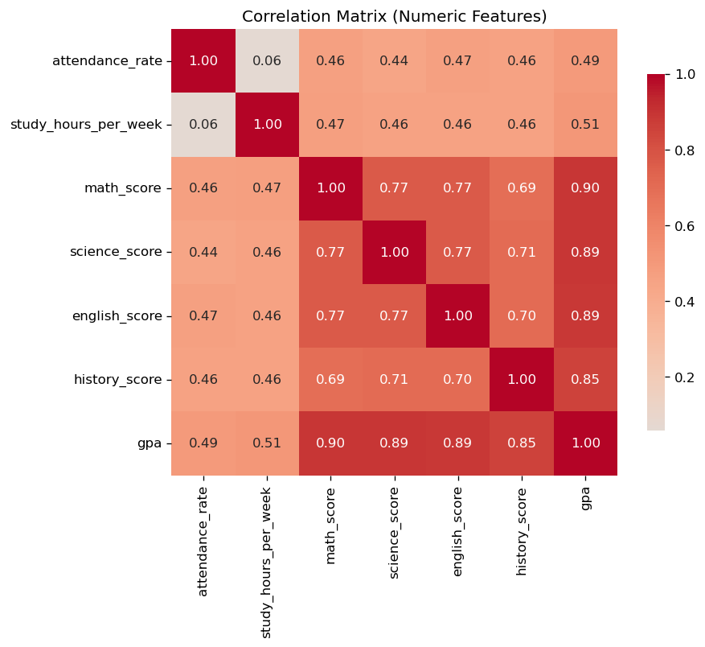

# Student Performance Analyzer

End-to-end Python data pipeline that generates a synthetic dataset of 550+ student records, cleans it, computes summary statistics and correlations, and produces six visualizations of academic outcomes.

Built as a portfolio project to demonstrate a clean Pandas / NumPy / Matplotlib workflow — synthetic data generation with realistic latent-variable correlations, defensive cleaning, grouped statistics, and reproducible chart output.



## What it does

**`generate_data.py`** — produces a 550-row CSV with realistic correlations. A latent "ability" score is built from study hours, attendance, parent education, extracurriculars, and internet access; subject scores and GPA are then derived from ability with noise. Missing values, duplicates, and `"92.5%"`-style dirty strings are intentionally injected.

**`main.py`** — modular pipeline:

1. **Load** the raw CSV.
2. **Clean** — drop duplicate `student_id`s, strip `%` from attendance, fill numeric nulls with the median and categorical nulls with the mode, recompute the `passed` flag from cleaned GPA.
3. **Analyze** — group statistics by grade level, gender, parent education, and extracurriculars; full correlation matrix across numeric columns.
4. **Visualize** — six charts saved to `output/`:
   - GPA distribution histogram
   - Average GPA by grade level (bar)
   - Study hours vs GPA (scatter + trend line)
   - Attendance rate vs GPA (scatter + trend line)
   - Correlation heatmap (numeric features)
   - Pass / fail breakdown by parent education (stacked bar)
5. **Summarize** — print total students, average GPA, pass rate, and top features correlated with GPA.

## Tech stack

Python 3.10+, Pandas, NumPy, Matplotlib. Seaborn is optional — the heatmap falls back to pure Matplotlib if it isn't installed.

## Setup

```bash
pip install -r requirements.txt
```

## Run

```bash
python generate_data.py   # writes students_raw.csv (reproducible — seeded RNG)
python main.py            # cleans, analyzes, saves charts to output/
```

## Sample output

```
============================================================
STUDENT PERFORMANCE — SUMMARY
============================================================
Total students analyzed : 550
Average GPA             : 2.32
Pass rate (GPA ≥ 2.0)   : 70.0%

Top features correlated with GPA:
  math_score                r = +0.896
  science_score             r = +0.894
  english_score             r = +0.889
```

## Project structure

```
student-performance-analyzer/
├── generate_data.py        # synthetic dataset generator
├── main.py                 # cleaning + analysis + visualization pipeline
├── requirements.txt
├── students_raw.csv        # generated on first run
└── output/                 # PNG charts (generated)
    ├── gpa_distribution.png
    ├── avg_gpa_by_grade.png
    ├── study_vs_gpa.png
    ├── attendance_vs_gpa.png
    ├── correlation_heatmap.png
    └── pass_by_parent_education.png
```
